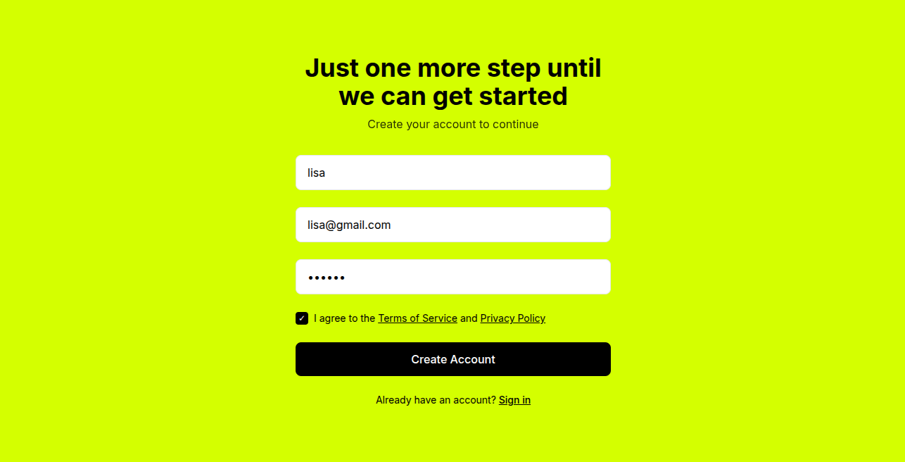
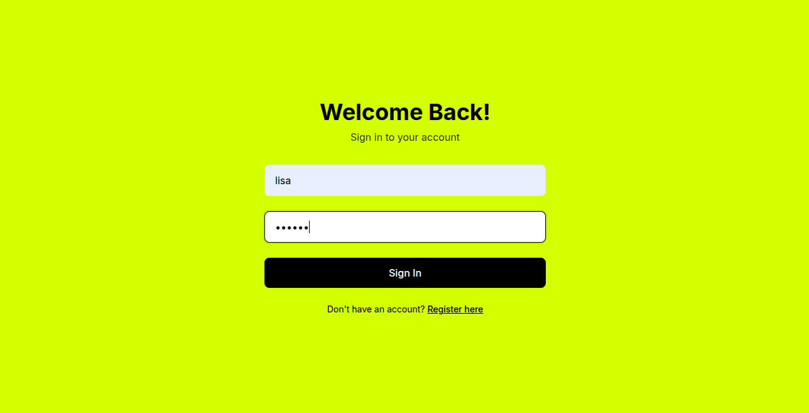
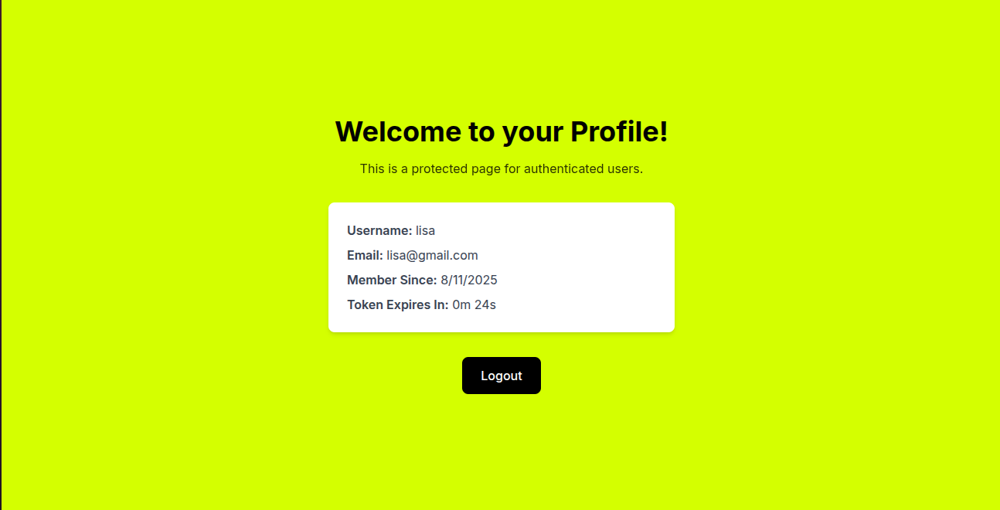
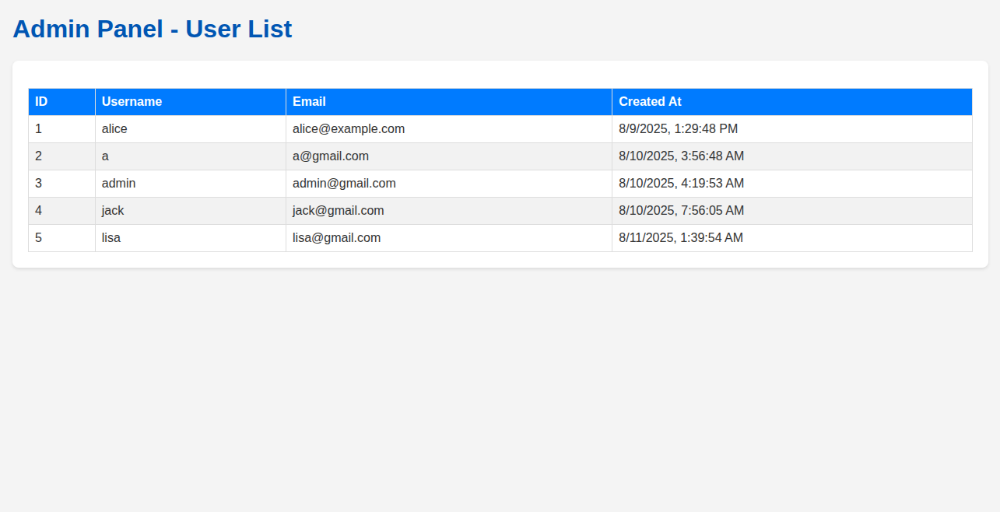

# ซอร์สโค้ดนี้ ใช้สำหรับเป็นตัวอย่างเท่านั้น ถ้านำไปใช้งานจริง ผู้ใช้ต้องจัดการเรื่องความปลอดภัย และ ประสิทธิภาพด้วยตัวเอง

# Node.js JWT Authentication with SQLite

This project is a simple yet complete full-stack application demonstrating user authentication using JSON Web Tokens (JWT) with a Node.js and Express backend, and a SQLite database. The frontend is built with HTML, TailwindCSS, and vanilla JavaScript.

## Features

-   **User Registration & Login**: Securely register and sign in users.
-   **Password Hashing**: Passwords are hashed using `bcrypt.js` before being stored.
-   **JWT Authentication**: User sessions are managed using JWTs, which are stored in `httpOnly` cookies for better security.
-   **Protected Routes**: Certain routes (`/profile`, `/admin`) are protected and require a valid JWT to be accessed.
-   **Admin Panel**: A special admin user (`admin@gmail.com`) can access a page to view all registered users.
-   **SQLite Database**: A lightweight, file-based database is used for storing user data.
-   **Token Expiration**: The user profile page displays a real-time countdown until the JWT expires.
-   **Modern UI**: The frontend is styled with TailwindCSS for a clean and modern look.

## Screenshots

| Sign Up / Register | Sign In | Profile Page | Admin Panel |
| :---: | :---: | :---: | :---: |
|  |  |  |  |

## Tech Stack

-   **Backend**: Node.js, Express.js
-   **Database**: SQLite3
-   **Authentication**: `jsonwebtoken`, `bcryptjs`, `cookie-parser`
-   **Frontend**: HTML, TailwindCSS, Vanilla JavaScript

## Getting Started

### Prerequisites

-   Node.js and npm installed on your machine.

### Installation & Setup

1.  **Clone the repository:**
    ```bash
    git clone <repository-url>
    cd <repository-name>
    ```

2.  **Install dependencies:**
    ```bash
    npm install
    ```

3.  **Set up environment variables:**
    Create a `.env` file in the root directory by copying the example file:
    ```bash
    cp .env.example .env
    ```
    Open the `.env` file and add a strong secret for your JWT:
    ```
    JWT_SECRET=your_super_secret_key_here
    ```

4.  **Run the server:**
    ```bash
    npm start
    or
    npm run dev
    ```
    The server will be running at `http://localhost:3000`.

## How It Works

1.  **Registration**: A new user is created via the `/register` endpoint. The password is encrypted before being saved to the SQLite database.
2.  **Login**: The user logs in via the `/login` endpoint. If the credentials are valid, the server generates a JWT.
3.  **Cookie**: The JWT is sent to the client and stored in an `httpOnly` cookie, which helps prevent XSS attacks.
4.  **Authentication Middleware**: On subsequent requests to protected pages (like `/profile`), a middleware function (`authenticateToken`) verifies the JWT from the cookie.
5.  **Authorization**: For admin-specific routes (`/admin`), an additional middleware (`authorizeAdmin`) checks if the authenticated user has admin privileges.
6.  **Frontend**: Vanilla JavaScript on the client-side makes `fetch` requests to the backend APIs and dynamically updates the UI with user data or redirects as necessary.

## API Endpoints

-   `POST /register`: Creates a new user.
-   `POST /login`: Authenticates a user and returns a JWT in a cookie.
-   `GET /`: Serves the main registration page (`index.html`).
-   `GET /signin`: Serves the sign-in page (`signin.html`).
-   `GET /profile`: (Protected) Serves the user profile page (`profile.html`).
-   `GET /api/profile`: (Protected) Returns the authenticated user's profile data.
-   `GET /admin`: (Admin Only) Serves the admin user list page (`admin.html`).
-   `GET /admin/users`: (Admin Only) Returns a list of all users.
